# 个人基金评估与模拟交易系统 · 详细设计说明书

> **版本**：v1.0（对应 BRD v1.2 / 需求确认记录 DC-001~012 / 技术可行性评估 v1.2 / 技术规格说明书 v1.3 / 原型 v1.2）  
> **定位**：从"技术蓝图"到"可直接编码"的施工图；覆盖架构、模块、数据、接口、安全、部署、备份、监控  
> **设计原则**：KISS / YAGNI / DRY；模块化单体；数据溯源贯穿；AI 仅增强不做核心

---

## 1. 概述

### 1.1 编写目的

本文档承接《业务需求说明书 BRD v1.2》与《技术规格说明书 v1.3》，将 12 个业务模块（FR-D1~~D6 + FR-01~~48）的**功能逻辑、数据模型、接口契约、算法流程、安全控制、部署运维**落实到可直接施工的粒度。目标读者为开发者、测试、运维及后续维护者。

### 1.2 适用范围

- 覆盖范围：仪表盘、基金数据中心、评估引擎、筛选器、模拟交易、组合与配置、学习投教、AI 助手、风险与监控、宏观市场、单基实验室、持仓穿透舆情，以及数据采集/调度/监控/备份等支撑子系统。
- 实施阶段：MVP（Phase 1）至远期（Phase 4），优先保证 Phase 1 闭环可运行。

---

## 2. 系统总体架构

### 2.1 系统上下文关系图

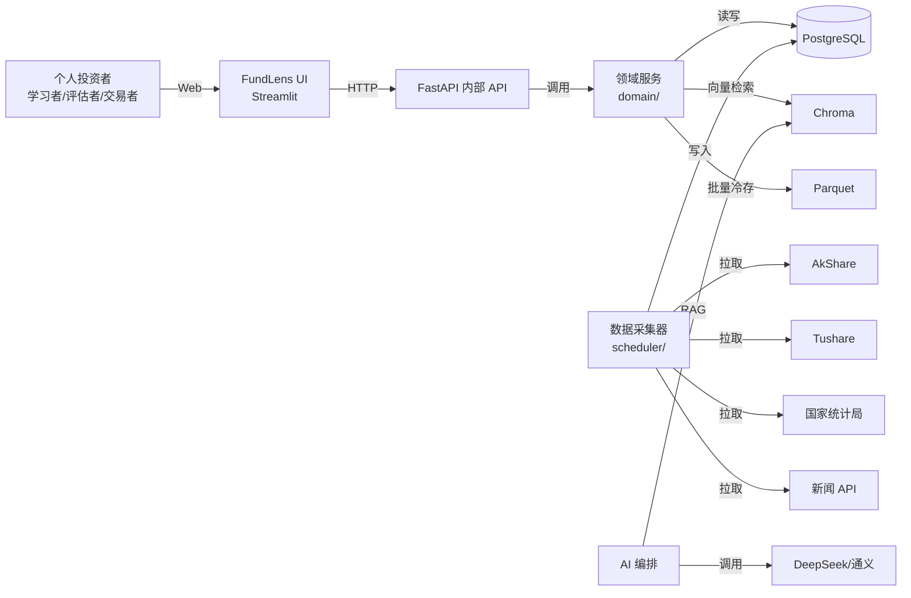

### 2.2 逻辑架构图

```
┌─────────────────────────────────────────────────────────────┐
│                    展示层（Presentation）                    │
│  Streamlit 单页应用：仪表盘 / 数据中心 / 评估 / 筛选 / 模拟   │
│  组合 / 宏观 / 实验室 / 穿透 / 学习 / AI / 风险              │
├─────────────────────────────────────────────────────────────┤
│                    接口层（API Layer）                       │
│  FastAPI：RESTful API + 输入校验 + 数据溯源（source/as_of）  │
├─────────────────────────────────────────────────────────────┤
│                    业务领域层（Domain）                      │
│  metrics / scoring / stylebox / attribution / research      │
│  screen / paper / portfolio / diagnosis / macro / lab       │
│  learning / risk / dashboard / field_glossary               │
├─────────────────────────────────────────────────────────────┤
│                    AI 增强层（AI Augment）                   │
│  rag / report / sentiment（RAG 检索、周报、舆情、失败降级）  │
├─────────────────────────────────────────────────────────────┤
│                    数据采集层（Data）                        │
│  sources / collector / quality（多源适配、增量、质量监控）   │
├─────────────────────────────────────────────────────────────┤
│                    存储层（Storage）                         │
│  PostgreSQL（事务/关系） + Parquet（净值历史） + Chroma（RAG）│
└─────────────────────────────────────────────────────────────┘
```

### 2.3 系统架构图（模块 + 存储）

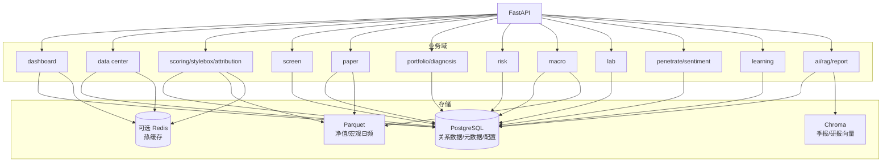

### 2.4 网络流量图

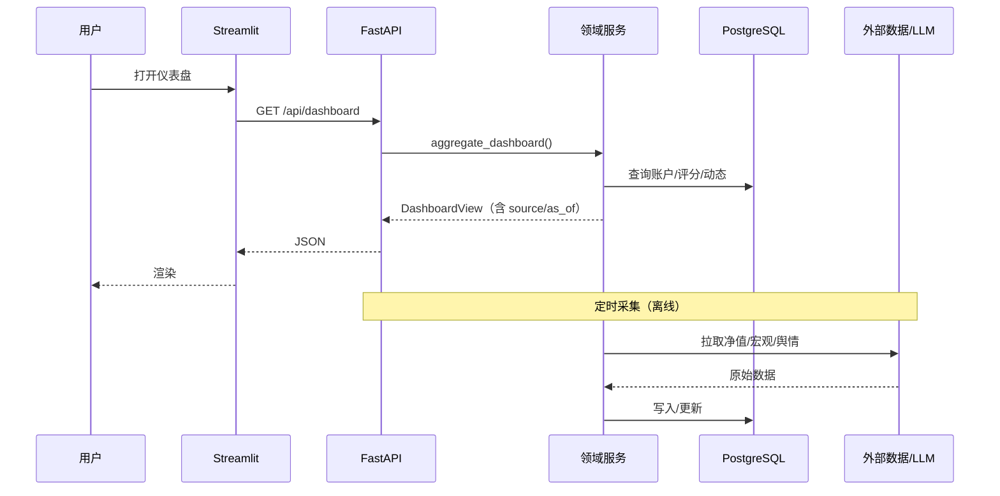

### 2.5 部署架构图

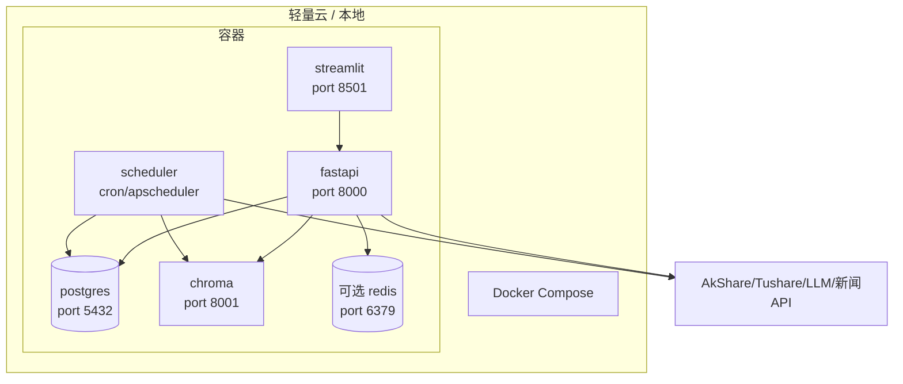

### 2.6 服务拆分设计

采用**模块化单体（Modular Monolith）**，而非微服务。原因：

| 维度   | 微服务      | 模块化单体（本系统）                      |
| ---- | -------- | ------------------------------- |
| 团队规模 | 需独立运维    | 单人 + AI Coding 可维护              |
| 部署成本 | 高（多容器编排） | 低（一个 docker-compose）            |
| 模块边界 | 进程边界     | 代码包边界（domain/ 下独立模块）            |
| 数据库  | 通常分库     | 单一 PostgreSQL，按 schema/table 隔离 |
| 延迟   | 网络调用     | 函数调用，低延迟                        |
| 可演进性 | 后期可拆分    | 模块边界清晰，未来可平滑拆出                  |

> **决策**：当前阶段不引入服务网格或消息队列（除可选 Redis 缓存）。模块间通过 Python 函数调用；FastAPI 与 Streamlit 同机部署。

### 2.7 技术栈选型设计

| 层级     | 选型                           | 版本/说明           |
| ------ | ---------------------------- | --------------- |
| 语言     | Python                       | 3.11            |
| Web 框架 | FastAPI                      | 0.110+，API + 校验 |
| 前端     | Streamlit                    | 1.35+，纯 Python  |
| ORM    | SQLAlchemy 2.x + Alembic     | 迁移              |
| 数据库    | PostgreSQL                   | 15+             |
| 分析库    | pandas / numpy / scipy       | —               |
| 金融指标   | empyrical / pyfolio-reloaded | 标准指标            |
| 回归/统计  | statsmodels / sklearn        | αβ、风格箱          |
| 回测     | vectorbt                     | 组合/定投回测         |
| 向量库    | Chroma                       | RAG             |
| 定时任务   | APScheduler                  | 替代 cron，便于容器内运行 |
| LLM 编排 | LangChain                    | RAG/周报/解读       |
| LLM    | DeepSeek-V2 / 通义千问           | 低价模型            |
| 数据源    | AkShare / Tushare / 国家统计局    | 免费/低成本          |
| 部署     | Docker / Docker Compose      | —               |
| 缓存（可选） | Redis                        | 7+，用于热数据缓存      |

### 2.8 Redis 存储数据详细描述

> Redis 为**可选增强层**（MVP 单机可省，生产 / 多副本下为必需，见 ADR-004 升级）；MVP 阶段可用 PostgreSQL + 应用内存缓存替代。若接入，建议缓存以下热数据：

| Key 模式                        | 数据内容            | TTL    | 用途         |
| ----------------------------- | --------------- | ------ | ---------- |
| `fund:dashboard:{account_id}` | 仪表盘聚合视图         | 5 min  | 减少首页重复查询   |
| `fund:top10:{type}`           | 某类型 Top10 综合评分  | 15 min | 仪表盘榜单      |
| `fund:score:{code}`           | 单基五因子评分+分解      | 30 min | 评估页/筛选页共享  |
| `fund:intraday:{code}`        | ETF/LOF 盘中价/折溢价 | 5 min  | 数据中心盘中估算   |
| `fund:glossary:{field}`       | 字段解释            | 1 h    | 全站 tooltip |
| `fund:macro:latest`           | 最新宏观卡           | 1 h    | 宏观看板       |

> 缓存失效策略：以 `code` + `trade_date` 为版本戳，写入时更新；定时任务刷新榜单缓存。

### 2.9 关联系统说明

| 外部系统          | 方向 | 数据/功能                            | 可靠性 | 备注                  |
| ------------- | -- | -------------------------------- | --- | ------------------- |
| AkShare       | 拉取 | 基金净值/基础/持仓/经理/宏观/情绪/ETF折溢价/美股/期货 | 中   | 主源，锁版本              |
| Tushare       | 拉取 | 全量基金/因子/财报/重仓股财务/场内价             | 高   | AkShare 失败 fallback |
| 国家统计局         | 拉取 | CPI/PMI/PPI/GDP/利率               | 极高  | 官方权威                |
| 新闻 API / 爬虫   | 拉取 | 持仓舆情新闻                           | 中   | 多源交叉                |
| 基金季报披露站点      | 拉取 | 季报 PDF                           | 高   | 官方披露                |
| DeepSeek / 通义 | 调用 | NL解析/研报解读/周报/情感                  | 中   | 低价模型，超时降级           |

> **预算与 SLA 确认（评审待确认⑤闭环）**：Tushare 采用积分档（基础接口免费，高阶因子/财报接口需积分，预算已确认）；AkShare 为主源免费；LLM 采用低价模型（DeepSeek-V2 / 通义千问），年度 token 成本 < 100 元已确认。三者均配置 fallback 与降级（详见 §2.15），外部依赖中断不阻塞核心查询。

### 2.10 关联系统接口

| 接口      | 协议                | 调用方式              | 输入               | 输出        |
| ------- | ----------------- | ----------------- | ---------------- | --------- |
| AkShare | Python SDK / HTTP | 函数调用              | 基金代码/日期          | DataFrame |
| Tushare | Python SDK / HTTP | pro_api           | token + 参数       | DataFrame |
| 国家统计局   | HTTP JSON / 表格    | requests          | 指标代码             | JSON/CSV  |
| 新闻 API  | HTTP JSON         | requests          | 股票代码/时间窗         | 新闻列表      |
| LLM API | HTTPS JSON        | openai-compatible | prompt + context | 文本        |

### 2.11 资源使用情况说明

| 资源         | 预估                      | 说明                   |
| ---------- | ----------------------- | -------------------- |
| CPU        | 单核峰值 80%（定时采集 + 批量指标计算） | 日常查询轻量               |
| 内存         | 2~4 GB                  | pandas 加载历史净值        |
| 磁盘         | 10~20 GB/年              | PostgreSQL + Parquet |
| 带宽         | 低                       | 主要为定时拉取外部数据          |
| LLM tokens | < 100 元/年               | 周评/解读/NL 解析          |

### 2.12 存储资源需求

| 数据         | 量级        | 存储方案                 | 容量      |
| ---------- | --------- | -------------------- | ------- |
| 基金主数据      | ~14k 条    | PostgreSQL           | < 10 MB |
| 净值（日频）     | ~3,500 万行 | Parquet 按年分区         | ~3 GB   |
| 持仓（季频）     | ~14k × 10 | PostgreSQL           | ~100 MB |
| 宏观/情绪/资金流  | 日频/月频     | PostgreSQL + Parquet | ~100 MB |
| 舆情新闻       | 万级        | PostgreSQL           | ~200 MB |
| 季报向量       | 百万 chunk  | Chroma               | ~1 GB   |
| 模拟账户/组合/笔记 | 单用户       | PostgreSQL           | < 10 MB |

### 2.13 运行环境

- **OS**：Ubuntu 22.04 LTS / Debian 12 / macOS（开发）
- **Python**：3.11+
- **Docker**：24+
- **PostgreSQL**：15+
- **Chroma**：0.4+
- **Redis**（可选）：7+

### 2.14 系统备份设计

#### 2.14.1 清理策略

- **净值历史**：保留全量，Parquet 按年归档。
- **日志/质量监控**：保留 90 天，超期清理或转冷存。
- **临时文件**：`/tmp/fund_*` 每日清理。
- **AI 周报/笔记**：用户数据保留全量。

#### 2.14.2 数据库备份策略

- **PostgreSQL**：每日凌晨 `pg_dump` 全量备份到对象存储/本地挂载。
- **Parquet**：对象存储版本控制或 rsync。
- **Chroma**：定时快照目录压缩备份。
- **恢复演练**：每月一次验证备份可还原。

### 2.15 系统容错设计

| 故障场景         | 策略                                  |
| ------------ | ----------------------------------- |
| AkShare 接口失效 | fallback Tushare；两者皆失则返回"数据暂不可用"并告警 |
| LLM 超时/限频    | 回退规则摘要；提示"可重试"                      |
| 数据库连接失败      | 接口返回 503，前端降级展示静态说明                 |
| 某模块计算失败      | 区块级降级，不影响其他模块                       |
| 数据缺失         | 字段置空并标注"暂无"，不阻塞                     |
| 极端行情导致指标异常   | 交叉验证标红，提示人工复核                       |

### 2.16 系统监控设计

| 监控对象   | 指标               | 告警阈值                    |
| ------ | ---------------- | ----------------------- |
| 数据采集   | 成功率、耗时、缺失天数      | 成功率 < 95% / 耗时 > 30 min |
| 数据质量   | 对账误差 >0.5%、异常标记  | 标红即告警                   |
| API 服务 | 响应时间、错误率、QPS     | P95 > 2s / 错误率 > 1%     |
| 定时任务   | 周报/舆情/估值信号是否按时产出 | 未执行即告警                  |
| 资源     | CPU / 内存 / 磁盘    | 磁盘 > 80%                |

### 2.17 应用模块清单

| 编号   | 模块名       | 对应 BRD 模块           | 对应技术规格目录                                                                |   优先级  |
| ---- | --------- | ------------------- | ----------------------------------------------------------------------- | :----: |
| 3.1  | 数据采集与质量监控 | 全局（FR-36/46）        | data/                                                                   |  Must  |
| 3.2  | 基金数据中心    | 模块一（FR-01~05）       | domain/field_glossary.py + data/                                        |  Must  |
| 3.3  | 基金评估引擎    | 模块二（FR-06~09,45）    | domain/metrics.py, scoring.py, stylebox.py, attribution.py, research.py |  Must  |
| 3.4  | 智能筛选器     | 模块三（FR-11~14）       | domain/screen.py                                                        |  Must  |
| 3.5  | 模拟交易      | 模块四（FR-15~19）       | paper/                                                                  |  Must  |
| 3.6  | 组合与配置     | 模块五（FR-20~24,37）    | domain/portfolio.py, diagnosis.py, backtest.py                          |  Must  |
| 3.7  | 宏观市场认知底盘  | 模块九（FR-38/39）       | domain/macro.py                                                         | Should |
| 3.8  | 单基深度实验室   | 模块十（FR-40~42）       | domain/laboratory.py                                                    |  Must  |
| 3.9  | 持仓穿透与舆情   | 模块十一（FR-43/44）      | ai/sentiment.py                                                         |  Could |
| 3.10 | 学习投教      | 模块六（FR-25~28,47,48） | domain/learning.py                                                      | Should |
| 3.11 | AI 智能助手   | 模块七（FR-29~32）       | ai/rag.py, ai/report.py                                                 |  Could |
| 3.12 | 风险与监控     | 模块八（FR-33~36,38）    | domain/risk.py + data/quality.py                                        | Should |
| 3.13 | 仪表盘首页     | 首页（FR-D1~D6）        | domain/dashboard.py                                                     |  Must  |
| 3.14 | 任务调度与监控   | 全局支撑                | scheduler/                                                              |  Must  |

### 2.18 组件版本信息描述

| 组件         | 版本      | 备注                 |
| ---------- | ------- | ------------------ |
| Python     | 3.11.x  | —                  |
| FastAPI    | 0.110.x | —                  |
| Streamlit  | 1.35.x  | —                  |
| SQLAlchemy | 2.0.x   | —                  |
| PostgreSQL | 15.x    | —                  |
| pandas     | 2.2.x   | —                  |
| empyrical  | 0.5.x   | 或 pyfolio-reloaded |
| vectorbt   | 0.26.x  | —                  |
| LangChain  | 0.2.x   | —                  |
| Chroma     | 0.4.x   | —                  |

### 2.19 安全设计

#### 2.19.1 配置类敏感信息必须加密

- API Key（Tushare/LLM/News）仅存 `.env` 或 Docker Secrets，**不提交代码库**。
- 数据库连接串使用环境变量注入。
- 生产环境对 `.env` 文件设置 600 权限。

#### 2.19.2 XSS 安全性拦截

- 前端为 Streamlit（受控组件），用户输入主要作为查询参数，**不做富文本渲染**。
- API 层对字符串输入做长度/字符白名单校验。
- 展示外部抓取文本（新闻标题）时做 HTML 转义。

#### 2.19.3 敏感数据加密

- 用户笔记/测评答案存储为普通文本（单用户自用，无 PII 强合规要求）。
- 管理端点鉴权与密码存储见 **§2.19.6（单用户 MVP 轻量鉴权）**：默认管理员账户 + 密码登录，密码以 AES-256 加密存储（密钥经 Docker Secrets / 环境变量注入，等价于密钥外部托管），不存明文；风险已评审接受。

#### 2.19.4 异常处理机制

- 所有对外接口统一返回 `{"code":0,"data":{},"source":"...","as_of":"...","message":""}`。
- 异常不暴露堆栈，记录到日志；前端显示"服务暂时不可用，请稍后重试"。
- 关键计算异常必须标红/降级，不得返回未标注的默认数值。

#### 2.19.5 文件上传要求

- 当前阶段**无用户上传**；若后续扩展 CSV 导入，限制：
  - 仅允许 `.csv/.xlsx`
  - 大小 ≤ 5 MB
  - 列名校验，禁止公式/宏
  - 服务端逐行解析，不执行任何脚本

---

### 2.19.6 管理端点鉴权（单用户 MVP）

- **定位**：本系统为单用户使用，不设多用户权限体系；但所有 `/api/admin/*`（含 `/api/admin/trigger-job`）必须鉴权，避免任意调用采集/重算/备份等高危操作。
- **默认账户**：系统初始化写入默认管理员账户（账户名可配置，默认 `admin`）；初始密码由首次启动从环境变量 / Docker Secrets 注入，强制首次登录修改。
- **密码存储**：密码**不存明文**，以 **AES-256 加密后落库**（密钥经 Docker Secrets / 环境变量注入，等价于密钥外部托管，非对称托管思路）；校验时解密比对，密钥不入库。
- **会话**：登录成功签发短期有效期令牌（默认 30 min，可配置）；后续 admin 请求须携带，过期重新登录。
- **风险接受**：在单用户 + 内网 / 本机部署前提下，该轻量鉴权方案风险已评审接受（见评审报告 S3 闭环记录）。

### 2.20 数据模型与 DDL 设计

> 本节闭环评审阻塞级 B2（§2.2 要求"数据库字段设计与 ER 图保持一致"）。所有表以 SQLAlchemy 2.x 声明式建模，由 Alembic 管理迁移（见 §2.7）。

#### 2.20.1 ER 图（实体关系）

```mermaid
erDiagram
    FUNDS ||--o{ NAVS : "日频净值"
    FUNDS ||--o{ HOLDINGS : "重仓股"
    FUNDS ||--o{ SCORES : "五因子评分"
    FUNDS ||--o{ RESEARCH_METRICS : "研究指标"
    FUNDS ||--o{ SENTIMENT_NEWS : "舆情"
    FUNDS ||--o{ VALUATION_SIGNALS : "估值信号"
    FUNDS ||--o{ DISCOVERY_ENTRIES : "发现入口"
    FUNDS ||--o{ FUND_DIVIDENDS : "分红"
    FUNDS }o--|| MANAGERS : "基金经理"
    HOLDINGS }o--|| STOCK_FINANCIALS : "财务"
    PAPER_ACCOUNTS ||--o{ PAPER_POSITIONS : "持仓"
    PAPER_ACCOUNTS ||--o{ PAPER_TRADES : "流水"
    PAPER_ACCOUNTS ||--o{ PORTFOLIOS : "组合"
    PAPER_ACCOUNTS ||--o{ RISK_ASSESSMENTS : "测评"
    PAPER_ACCOUNTS ||--o{ ALERTS : "预警"
    PAPER_ACCOUNTS ||--o{ NOTES : "笔记"
    PAPER_ACCOUNTS ||--o{ CASE_REPLAY_LOGS : "沙盒"
    PAPER_ACCOUNTS ||--o{ BEHAVIOR_ASSESSMENTS : "行为"
    PORTFOLIOS ||--o{ PORTFOLIO_WEIGHTS : "权重"
    PORTFOLIOS ||--|| REBALANCE_RULES : "再平衡"
    MACRO_INDICATORS ||--o{ MARKET_SENTIMENT : "情绪"
```

#### 2.20.2 核心表 DDL（PostgreSQL，范式 + 外键 + 索引）

```sql
CREATE TABLE funds (
  code        VARCHAR(12) PRIMARY KEY,
  name        VARCHAR(64) NOT NULL,
  type        VARCHAR(16) NOT NULL,   -- equity/bond/mixed/stock/etf/lof...
  sub_type    VARCHAR(32),
  theme       VARCHAR(32),
  style       VARCHAR(16),
  launch_date DATE,
  source      VARCHAR(32) NOT NULL,
  as_of       DATE NOT NULL,
  created_at  TIMESTAMPTZ DEFAULT now(),
  updated_at  TIMESTAMPTZ DEFAULT now()
);
CREATE INDEX ix_funds_type_theme ON funds(type, theme);

CREATE TABLE navs (
  code        VARCHAR(12) NOT NULL REFERENCES funds(code) ON DELETE CASCADE,
  trade_date  DATE NOT NULL,
  nav         NUMERIC(18,4) NOT NULL,
  acc_nav     NUMERIC(18,4),
  adj_nav     NUMERIC(18,4) NOT NULL,
  is_estimate BOOLEAN DEFAULT false,
  source      VARCHAR(32) NOT NULL,
  as_of       DATE NOT NULL,
  PRIMARY KEY (code, trade_date)
) PARTITION BY RANGE (trade_date);
CREATE INDEX ix_navs_date ON navs(trade_date);

CREATE TABLE holdings (
  code        VARCHAR(12) NOT NULL REFERENCES funds(code) ON DELETE CASCADE,
  report_date DATE NOT NULL,
  stock_code  VARCHAR(12) NOT NULL,
  stock_name  VARCHAR(64),
  weight      NUMERIC(12,6),
  source      VARCHAR(32) NOT NULL,
  as_of       DATE NOT NULL,
  PRIMARY KEY (code, report_date, stock_code)
);

CREATE TABLE scores (
  code      VARCHAR(12) PRIMARY KEY REFERENCES funds(code) ON DELETE CASCADE,
  window    VARCHAR(8) DEFAULT '3y',
  weights   JSONB NOT NULL,   -- {"ret":30,"risk":25,"style":20,"cost":15,"scale":10}
  composite NUMERIC(8,4) NOT NULL,
  factors   JSONB NOT NULL,   -- 五因子分解
  as_of     DATE NOT NULL,
  updated_at TIMESTAMPTZ DEFAULT now()
);

CREATE TABLE research_metrics (
  code          VARCHAR(12) PRIMARY KEY REFERENCES funds(code) ON DELETE CASCADE,
  alpha         NUMERIC(12,6),
  beta          NUMERIC(12,6),
  tracking_error NUMERIC(12,6),
  info_ratio    NUMERIC(12,6),
  peg           NUMERIC(12,6),
  erp           NUMERIC(12,6),
  peg_available BOOLEAN DEFAULT false,
  erp_available BOOLEAN DEFAULT false,
  cv_flag       BOOLEAN DEFAULT false,
  as_of         DATE NOT NULL
);

CREATE TABLE paper_accounts (
  account_id   VARCHAR(32) PRIMARY KEY,
  init_capital NUMERIC(18,2) NOT NULL DEFAULT 1000000,
  cash         NUMERIC(18,2) NOT NULL,
  created_at   TIMESTAMPTZ DEFAULT now()
);

CREATE TABLE paper_positions (
  account_id VARCHAR(32) NOT NULL REFERENCES paper_accounts(account_id) ON DELETE CASCADE,
  code       VARCHAR(12) NOT NULL REFERENCES funds(code) ON DELETE CASCADE,
  shares     NUMERIC(18,4) NOT NULL,
  cost       NUMERIC(18,4) NOT NULL,
  updated_at TIMESTAMPTZ DEFAULT now(),
  PRIMARY KEY (account_id, code)
);

CREATE TABLE paper_trades (
  trade_id   BIGSERIAL PRIMARY KEY,
  account_id VARCHAR(32) NOT NULL REFERENCES paper_accounts(account_id) ON DELETE CASCADE,
  code       VARCHAR(12) NOT NULL REFERENCES funds(code),
  side       VARCHAR(4) NOT NULL CHECK (side IN ('buy','sell')),
  shares     NUMERIC(18,4) NOT NULL,
  nav        NUMERIC(18,4) NOT NULL,
  trade_date DATE NOT NULL,
  created_at TIMESTAMPTZ DEFAULT now()
);
CREATE INDEX ix_trades_account ON paper_trades(account_id, trade_date);

CREATE TABLE portfolios (
  portfolio_id VARCHAR(32) PRIMARY KEY,
  account_id   VARCHAR(32) NOT NULL REFERENCES paper_accounts(account_id) ON DELETE CASCADE,
  name         VARCHAR(64),
  source       VARCHAR(16) CHECK (source IN ('template','manual','import')),
  created_at   TIMESTAMPTZ DEFAULT now()
);

CREATE TABLE portfolio_weights (
  portfolio_id VARCHAR(32) NOT NULL REFERENCES portfolios(portfolio_id) ON DELETE CASCADE,
  code         VARCHAR(12) NOT NULL REFERENCES funds(code),
  weight       NUMERIC(8,4) NOT NULL,
  PRIMARY KEY (portfolio_id, code)
);
```

#### 2.20.3 建表约定

- 所有表含 `created_at` / `updated_at`（`TIMESTAMPTZ DEFAULT now()`）；业务表附加 `source` / `as_of` 溯源字段。
- 枚举/类别用 `VARCHAR` + `CHECK` 或独立字典表；金额用 `NUMERIC(18,4)`，比率用 `NUMERIC(12,6)`。
- 外键列、常用过滤列（`type` / `theme` / `trade_date`）建 B-tree 索引；净值 / 宏观按年分区（见 §2.12）。
- 其余表（`managers`、`fund_dividends`、`discovery_entries`、`field_glossary`、`macro_indicators`、`market_sentiment`、`external_signal`、`sentiment_news`、`stock_financials`、`rag_documents`、`ai_weekly_reports`、`risk_assessments`、`alerts`、`valuation_signals`、`data_quality_log`、`notes`、`learning_paths`、`case_scenarios`、`case_replay_logs`、`behavior_assessments`、`data_collection_jobs`、`scheduler_jobs`）遵循同一约定，字段以 §3.x.4 表清单为准，迁移由 Alembic 统一管理。

---

### 2.21 接口数据契约（字段级，闭环评审 S4）

> 本节定义统一字段命名 / 类型约定与响应信封，并对核心端点给出字段级 schema；其余端点沿用同模式（§4.2 错误码、§5.2 信封）。

#### 2.21.1 字段命名与类型约定

| 约定   | 规则                                                                |
| ---- | ----------------------------------------------------------------- |
| 命名   | `snake_case`；日期 `YYYY-MM-DD`；时间戳 `YYYY-MM-DDTHH:MM:SSZ`（ISO-8601） |
| 基金代码 | 字符串，带后缀（如 `000001.OF`、`510300.SH`）                                |
| 金额   | `numeric(18,4)`；比率 / 权重 `numeric(12,6)`；评分 `0–100` 整数或 1 位小数      |
| 分页   | list 类接口支持 `page` / `page_size`，响应含 `total` / `items`             |
| 信封   | 见 §5.2：`{code,data,source,as_of,disclaimer,message,trace_id}`     |
| 错误   | 见 §4.2 错误码枚举；失败时 `data=null`                                      |

#### 2.21.2 重点端点字段级 schema

**GET `/api/dashboard`**

```json
{ "portfolio_return": 0.1234, "benchmark_return": 0.0890,
  "todos": [{"type":"rebalance","text":"..."}], "learning_progress": 0.6,
  "top10": [{"code":"000001.OF","name":"华夏成长","score":82.3,"type":"mixed"}],
  "dynamics": [{"type":"dividend|signal|new|anomaly","title":"...","date":"2025-07-20"}] }
```

**GET `/api/funds/{code}/score`**

```json
{ "code":"000001.OF", "weights":{"ret":30,"risk":25,"style":20,"cost":15,"scale":10},
  "composite": 82.3,
  "factors":{"ret":88.0,"risk":75.0,"style":80.0,"cost":70.0,"scale":65.0},
  "as_of":"2025-07-20" }
```

**POST `/api/screen`**（表单）

```json
// req:  {"filters":[{"field":"type","op":"in","value":["mixed","stock"]},
//                    {"field":"score","op":">=","value":80}], "sort":"composite","order":"desc","page":1,"page_size":20}
// resp: {"items":[{"code":"000001.OF","name":"...","score":82.3}], "total":136}
```

**POST `/api/screen/nl`**（自然语言）

```json
// req:  {"query":"近一年收益靠前的稳健混合基","context":{"account_id":"u1"}}
// resp: {"intent":"screen","conditions":[{"field":"type","op":"=","value":"mixed"},
//         {"field":"score","op":">=","value":80},{"field":"window","op":"=","value":"1y"}],
//        "confidence":0.92,"clarify":null}
//       若歧义：{"clarify":"请问'稳健'按最大回撤<15% 还是波动率<10%？","confidence":0.55}
```

**POST `/api/paper/buy`**

```json
// req:  {"code":"000001.OF","amount":10000,"trade_date":"2025-07-20"}   // 或 {"shares":1000}
// resp: {"trade_id":1024,"position":{"code":"000001.OF","shares":1000,"cost":1.0120},
//        "cash":990000.00,"trade_date":"2025-07-20"}
```

#### 2.21.3 契约维护

- 其余端点（macro / lab / sentiment / portfolio / risk / learning / ai / admin）沿用同一信封与字段约定，字段以对应模块 §3.x 数据库设计 + 业务语义为准。
- 本节约定的 schema 为联调基线；实现期增减字段须同步更新本文档与 OpenAPI 描述，保证前后端一致。

---

### 2.22 性能与并发优化设计（闭环性能优化改造）

> 本节固化"保持模块化单体（ADR-001）前提下的性能优化"：并行 I/O + 多进程 CPU 批算 + 独立 worker + 无状态角色多副本。对应改造模块：§3.1 采集、§3.3 评估引擎、§3.4 筛选/NL、§3.5/§3.6 回测、§3.9 舆情、§3.11 AI、§3.14 调度。

#### 2.22.1 优化总原则

- **GIL 约束**：I/O 密集（网络拉取、LLM 调用）用线程 / `asyncio`；**CPU 密集（评分 / 归因 / 回测）必须用 `multiprocessing` 或向量化 `numpy`/`pandas`，多线程无效**。
- **共享状态收敛到 Redis**（见 §2.8 与 ADR-004 升级）：评分缓存、admin 会话（§2.19.6）、调度锁（§3.14.6）。
- **单一代码库、多实例**：多副本 = 同一镜像起多个进程 / 容器，非微服务拆分。

#### 2.22.2 并发模型与默认参数

| 场景 | 模型 | 默认参数 | 说明 |
|------|------|----------|------|
| 采集并发拉取 | `ThreadPoolExecutor` / `asyncio` | `COLLECTOR_THREADS = min(32, CPU×4)` | 每数据源独立池 |
| 采集分片 | 按 `fund code` hash 取模 | `SHARD_COUNT = 4`（可调） | 分片到 N 个 collector 副本 |
| 批算（评分/归因） | `ProcessPoolExecutor` | `SCORE_PROC = CPU 核数` | 按 fund 分片 |
| LLM 调用 | `async` + `Semaphore` | `LLM_SEMAPHORE = 5`（按配额） | 超量入队，防 429 |
| API | uvicorn / gunicorn 多 worker | `workers = CPU×2` | 无状态，可多副本 |
| 缓存 | Redis | 见 §2.8 | 多副本一致 |

#### 2.22.3 多副本角色与边界

- **可多副本（无状态，水平扩展）**：API（FastAPI）、collector（按基金分片）、批算 worker（按基金 / 场景分片）。
- **不副本（单点 / 需协调）**：PostgreSQL、Chroma（单一存储 ADR-003）；scheduler（单 leader + Redis 锁，见 §3.14.6）。
- **Streamlit** 单实例（单用户）；**Redis** 在多副本下为必需（ADR-004 升级）。

#### 2.22.4 分布式锁与调度防重

- scheduler 多副本时，任务触发前获取 Redis `SET key uuid NX EX` 锁（`fund:scheduler:lock:{job}`），获锁才执行，执行完删锁；未获锁跳过。或单 leader（`SCHEDULER_LEADER=true` 仅一个副本）。
- 采集分片天然互斥（按 code hash），锁为兜底防脑裂。

#### 2.22.5 缓存与幂等

- 评分 / 榜单 / 字段解释 / 盘中价走 Redis（§2.8），保证多副本数据一致。
- 所有采集 / 批算幂等（§3.14.5），重跑不产生重复行。

---

## 3. 各功能模块设计

> 每个模块按以下子节展开（按需取舍）：功能说明、流程/逻辑实现、页面设计、数据库设计、Redis 设计、接口设计、安全与溯源。


---

### 3.1 数据采集与质量监控模块

#### 3.1.1 功能说明

负责从 AkShare/Tushare/国家统计局/新闻 API 等外部源拉取数据，进行清洗、校验、增量写入，并产出数据质量监控指标（FR-36）。是其他所有模块的数据底座。

#### 3.1.2 流程/逻辑实现

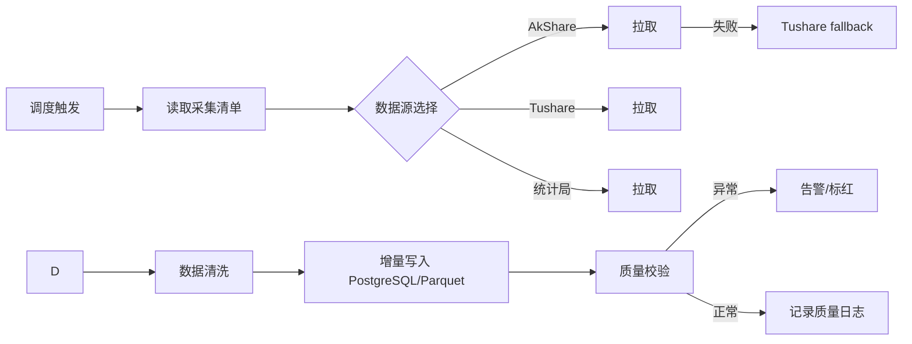

#### 3.1.3 页面设计

- 运维后台页：采集任务状态、成功率、最近缺失日期、对账误差标红列表。
- 前端展示层通过 `/api/quality/dashboard` 展示关键指标。

#### 3.1.4 数据库设计

- 见技术规格 `data_quality_log` 表。
- 采集任务清单表 `data_collection_jobs`（可选）：`entity`, `source`, `schedule`, `last_run`, `status`, `next_run`。

#### 3.1.5 Redis 设计

- 热键 `fund:quality:latest`：最新质量看板快照，TTL 5 min。

#### 3.1.6 接口设计

- `GET /api/quality/dashboard` → 成功率/时效/对账误差/标红列表。

#### 3.1.7 安全与溯源

- 所有采集数据写入 `source` 与 `as_of` 字段；质量日志不可删改（可清理但保留摘要）。

---

### 3.1.8 并发采集与分片设计（性能优化改造）

- **分片**：基金 universe 按 `code` 的 MD5 取模分为 `SHARD_COUNT` 片；每个 collector 副本通过环境变量 `SHARD_ID` / `SHARD_COUNT` 认领一片，副本间互不重叠。
- **单副本内并发**：I/O 密集 → `ThreadPoolExecutor` 并发拉取（AkShare 主源；失败按 §2.15 fallback Tushare；429 指数退避）。
- **多副本部署**：docker-compose 起 N 个 `collector` 服务实例，注入不同 `SHARD_ID`，墙钟时间 ≈ 单副本 / N（见 §2.22.2 / §2.22.3）。

```python
import hashlib
from concurrent.futures import ThreadPoolExecutor, as_completed

def shard_of(code: str, n: int) -> int:
    return int(hashlib.md5(code.encode()).hexdigest(), 16) % n

def collect_shard(shard_id: int, n: int, threads: int = 32):
    codes = [c for c in all_fund_codes() if shard_of(c, n) == shard_id]
    with ThreadPoolExecutor(max_workers=threads) as ex:
        futs = [ex.submit(pull_and_persist, c) for c in codes]   # 拉取→清洗→增量写PG→质量日志
        for f in as_completed(futs):
            f.result()                                          # 异常向上抛，由 §2.15 容错处理
```

- **幂等**：`pull_and_persist` 按 `(code, trade_date)` upsert，重跑不产生重复行（§3.14.5）。
- **质量聚合**：每片结束写 `data_quality_log` 分片成功率 / 缺失天数（§3.1.4），运维看板聚合。

---

### 3.2 基金数据中心模块

#### 3.2.1 功能说明

全市场基金研究底盘：全类型检索（含 ETF/LOF）、净值复权/下载/盘中估算、档案分组+字段解释、前十大+行业分布（跳穿透）、经理风格箱（FR-01~05，DC-002）。

#### 3.2.2 流程/逻辑实现

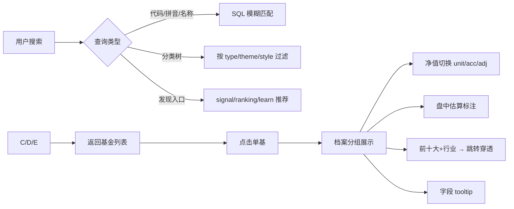

#### 3.2.3 页面设计

- 原型页 ②：搜索框 + 分类树 + 发现入口；档案分组；净值切换+下载；持仓穿透链接；经理风格箱。

#### 3.2.4 数据库设计

- 主表：`funds`, `navs`, `holdings`, `managers`, `fund_dividends`, `discovery_entries`, `field_glossary`。
- 索引：`funds(type, sub_type, theme, style)`, `navs(code, trade_date)`, `holdings(code, report_date)`。

#### 3.2.5 Redis 设计

- `fund:glossary:{field}`：字段解释缓存。
- `fund:intraday:{code}`：盘中估算缓存。

#### 3.2.6 接口设计

- `GET /api/funds/search`, `/api/funds/tree`, `/api/funds/discovery`
- `GET /api/fields/{name}`
- `GET /api/funds/{code}`, `/api/funds/{code}/nav`, `/api/funds/{code}/intraday`, `/api/funds/{code}/download`, `/api/funds/{code}/holdings`, `/api/funds/{code}/manager`

#### 3.2.7 安全与溯源

- 盘中估算字段 `is_estimate=True`，响应强制标注"仅供参考，以收盘净值为准"（FR-46）。
- 下载文件头包含数据源与截至日期。

---

### 3.3 基金评估引擎模块

#### 3.3.1 功能说明

系统"评估大脑"：核心指标（默认 3 年滚动）、五因子综合评分（默认权重 30/25/20/15/10，可调并实时分解）、风格箱（持仓+收益回归交叉验证）、Brinson 归因（仅主动股混基，范围常量 `BRINSON_SCOPE=["mixed","stock"]`）、研究型指标卡片（FR-06~09/45，DC-003）。

#### 3.3.2 流程/逻辑实现

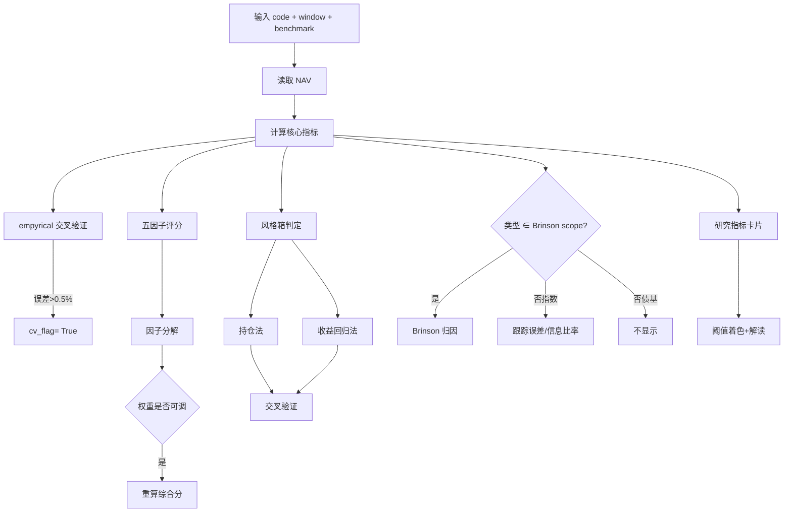

#### 3.3.3 页面设计

- 原型页 ③：区间/基准选择；核心指标卡；五因子评分+因子分解条+滑杆；风格箱；Brinson 归因；研究指标卡。

#### 3.3.4 数据库设计

- `scores`（五因子+权重 JSON）, `research_metrics`（αβ/跟踪误差/折溢价/PEG/ERP + cv_flag）。

#### 3.3.5 Redis 设计

- `fund:score:{code}`：评分结果缓存，TTL 30 min；权重变更时立即失效。

#### 3.3.6 接口设计

- `GET /api/funds/{code}/metrics`, `/api/funds/{code}/score`, `/api/funds/{code}/stylebox`, `/api/funds/{code}/attribution`, `/api/funds/{code}/research`

#### 3.3.7 安全与溯源

- 评估引擎为**唯一评分权威源**；筛选器/仪表盘只读引用，不得本地重算（DC-003）。
- 所有数值返回 `source` + `as_of` + `cv_flag`。
- **PEG/ERP 基金层代理口径（消除难点 A，对齐技术规格 v1.3）**：PEG 按重仓股加权（主动基）/ 跟踪基准加权（指数ETF），债基返回 None；ERP 用组合盈利收益率(EY) − 10Y 国债；展示时名称须带"(代理)"、解读须含"相对高低提示，非绝对结论"；持仓缺失时回退跟踪基准，不可得则 `available=False` 且卡片显"代理值待定"。**开启 `RESEARCH_PROXY_GUARD`，口径未定义前 `research_metrics.peg/erp` 一律为 None，禁止 naive 计算。**

---

### 3.3.8 评分与归因算法公式（闭环评审 S5）

#### 3.3.8.1 五因子综合评分合成

- **因子与权重**：收益 `ret`(30) / 风险 `risk`(25) / 风格适配 `style`(20) / 成本 `cost`(15) / 规模 `scale`(10)。权重常量 `SCORE_WEIGHTS={"ret":30,"risk":25,"style":20,"cost":15,"scale":10}`，可配置（ADR-002，仅在评估详情页调节）。
- **子分归一化**：每个因子原始指标先映射为 **0–100 子分 `s_k`**，默认采用**横截面百分位排名**（该基金在同类 / 全市场 universe 中的百分位 × 100）；可选 z-score 标准化后经 Sigmoid 映射到 0–100。某因子原始值缺失则其 `s_k=None`，合成时剔除该因子权重。
- **综合分**：
  ```
  composite = Σ_k (w_k · s_k) / Σ_k w_k        # 仅对有效因子求和，分母随之缩小
  ```
  结果区间 0–100，越高越好；返回各 `s_k` 与贡献 `w_k·s_k`（因子分解），前端滑杆调权后即时按上式重算。

#### 3.3.8.2 Brinson 业绩归因（仅 `BRINSON_SCOPE=["mixed","stock"]`）

- **输入**：基金有效持仓权重 `w_p,i`（按重仓股 / 资产类聚合到层级 `i`）、基准权重 `w_b,i`、层级收益 `R_p,i` / `R_b,i`；基准默认取对应宽基（如沪深300 / 中证全指）。
- **三向分解**：
  ```
  Allocation   = Σ_i (w_p,i − w_b,i) · R_b,i          # 配置效应
  Selection    = Σ_i w_b,i · (R_p,i − R_b,i)         # 选券效应
  Interaction  = Σ_i (w_p,i − w_b,i) · (R_p,i − R_b,i)  # 交互效应
  ActiveReturn = Allocation + Selection + Interaction
  ```
- **范围处理**：指数基（ETF / 被动）不显示 Brinson，改显跟踪误差 `TE` 与信息比率 `IR = α / TE`；债基不显示。持仓缺失（holdings 为空）则归因 `unavailable=True`。

---

### 3.3.9 批量计算并发与缓存设计（性能优化改造）

- **CPU 密集 → 多进程**：评分 / 归因对全市场基金计算属 CPU 密集，用 `ProcessPoolExecutor` 跨基金并行（非多线程，受 GIL 限制，见 §2.22.1）。
- **夜算 + 缓存**：由 §3.14.2 工作日 18:30 触发，结果写 PG（`scores` / `research_metrics`）+ 刷新 Redis（`fund:score:{code}` TTL 30min，§2.8）。
- **在线查询**：优先读缓存；未命中才即时算单基（单基成本可控），保证多副本一致（ADR-002 唯一权威）。

```python
from concurrent.futures import ProcessPoolExecutor

def score_one(code: str) -> dict:
    nav = load_nav(code)                                 # CPU: 滚动指标 + empyrical 交叉验证
    factors = compute_factors(nav)                      # 五因子子分（横截面百分位，§3.3.8.1）
    composite = weighted_sum(factors, SCORE_WEIGHTS)     # §3.3.8.1
    brinson = brinson_attribution(code) if scope_ok(code) else None   # §3.3.8.2
    return {"composite": composite, "factors": factors, "brinson": brinson}

def batch_score_all(proc: int = SCORE_PROC):
    codes = all_fund_codes()
    with ProcessPoolExecutor(max_workers=proc) as ex:
        for code, res in zip(codes, ex.map(score_one, codes)):
            upsert_scores(code, res)                              # PG
            redis.set(f"fund:score:{code}", json.dumps(res), ex=1800)

def get_score(code: str) -> dict:                                # 在线查询
    cached = redis.get(f"fund:score:{code}")
    return json.loads(cached) if cached else score_one(code)     # 未命中即时算
```

- **权重变更**：评估页调节权重后按 §3.3.8.1 即时重算，并 `redis.delete(fund:score:{code})` 失效缓存（§2.8）。
- **一致性**：全站评分来自同一批算结果，仪表盘 / 筛选 / 组合共享，无漂移（ADR-002）。

---

### 3.4 智能筛选器模块

#### 3.4.1 功能说明

条件组合筛选 + 自然语言选基 + 评分排行 + 持仓相似去重（FR-11~14，DC-004）。

#### 3.4.2 流程/逻辑实现

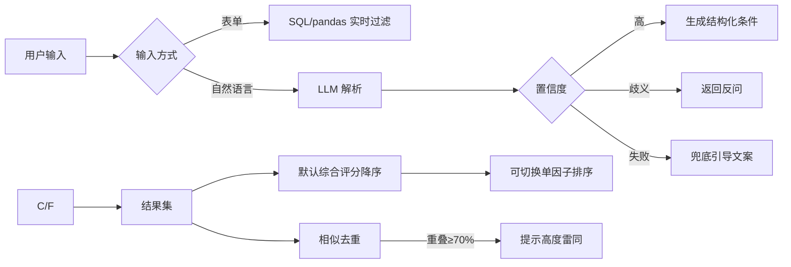

#### 3.4.3 页面设计

- 原型页 ④：左表单（AND/OR）+ 右实时结果；NL 输入框+解析回显；单因子排序；相似去重提示。

#### 3.4.4 数据库设计

- 复用 `funds`, `scores`, `holdings`。
- 自然语言解析映射表 `nl_mapping_log`（可选，用于评测与迭代）。

#### 3.4.5 Redis 设计

- 筛选结果通常实时计算，可缓存高频查询 `screen:{hash}` TTL 5 min。

#### 3.4.6 接口设计

- `POST /api/screen`, `POST /api/screen/nl`, `GET /api/screen/dedup`

#### 3.4.7 安全与溯源

- NL 解析歧义必须反问，不臆测。
- NL 解析需达到准确率硬指标：`NL_ACCURACY_TARGET=0.85`（基于 100 条标注评测集评估，未达标走规则兜底 + 人工复核），禁止在低于置信度时臆测生成条件。
- 相似去重阈值可配置（`SIMILARITY_OVERLAP=0.70`, `SIMILARITY_CORR=0.90`）。
- 结果标注评分来源与截至时间。

---

### 3.4.8 并发与限流设计（性能优化改造）

- **表单筛选**：单请求内 pandas 向量化过滤 + 排序，无需并发；结果缓存 `screen:{hash}` TTL 5min（§2.8）。
- **NL 解析（I/O 密集 + 限频）**：LLM 调用经 `asyncio.Semaphore(LLM_SEMAPHORE)` 限流，超量进入 `asyncio.Queue` 排队，避免触发 429 降级（§2.15）。

```python
import asyncio

sem = asyncio.Semaphore(LLM_SEMAPHORE)   # 默认 5，按 LLM 配额配置

async def parse_nl(query: str, ctx: dict) -> dict:
    async with sem:                                  # 限流：超出则等待而非并发冲击
        raw = await llm_complete(build_prompt(query, ctx))
    intent = rule_normalize(parse_json(raw))          # 规则兜底（§3.4.7）
    return intent                                     # 含 confidence / clarify

# 多请求并发：asyncio.gather(*[parse_nl(q, c) for q, c in batch]) 自然受 sem 控制
```

---

### 3.5 模拟交易模块

#### 3.5.1 功能说明

虚拟账户闭环：默认 100 万、可重置、T 日净值成交、非交易时段顺延、持仓盈亏看板、历史定投回测、亏损联动回本测算（FR-15~19，DC-005）。

#### 3.5.2 流程/逻辑实现

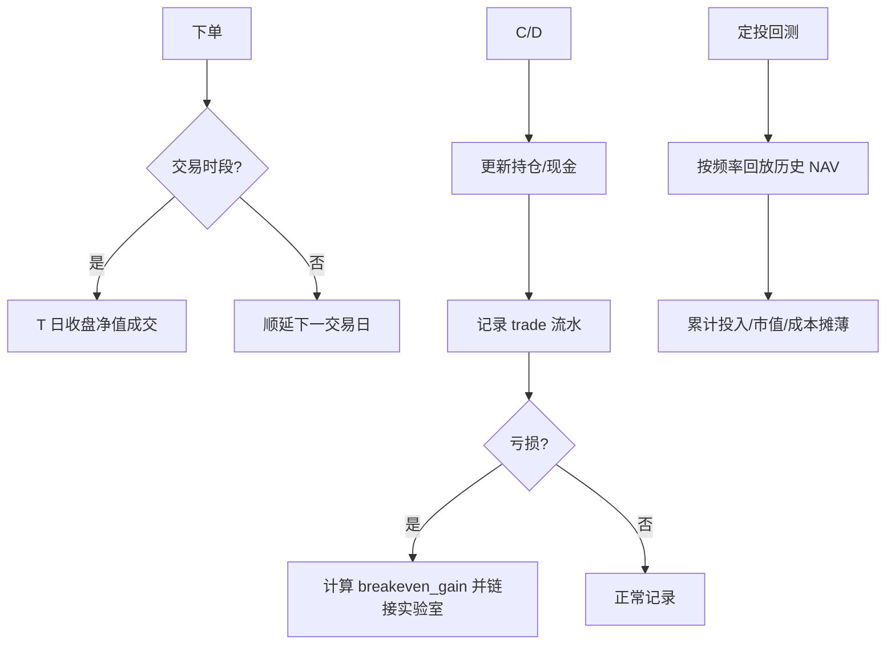

#### 3.5.3 页面设计

- 原型页 ⑤：账户四卡；买卖表单（含买入逻辑）；持仓看板（亏损标红+回本链接）；定投回测面板；复盘笔记。

#### 3.5.4 数据库设计

- `paper_accounts`, `paper_positions`, `paper_trades`。
- 分红处理：复权净值自动调整份额/成本。

#### 3.5.5 Redis 设计

- `paper:portfolio:{account_id}`：持仓快照缓存，TTL 1 min。

#### 3.5.6 接口设计

- `POST /api/paper/buy`, `POST /api/paper/sell`, `GET /api/paper/portfolio`, `POST /api/paper/dca-backtest`, `POST /api/paper/reset`

#### 3.5.7 安全与溯源

- 账户与实盘完全隔离；重置操作需二次确认。
- 成交 NAV 必须来自 `navs` 真实收盘净值，禁止用盘中估算成交。

---

### 3.5.8 定投回测并发设计（性能优化改造）

- `dca_backtest`（§3.5.2）用 vectorbt 向量化回放历史 NAV，单场景已高效。
- **多情景并行**：保守 / 基准 / 乐观三情景（§3.8）参数组用 `ProcessPoolExecutor` 并行计算；结果按 `(account_id, params_hash)` 缓存，避免重复回放。

```python
from concurrent.futures import ProcessPoolExecutor

def dca_backtest_parallel(account_id, scenarios: list):
    with ProcessPoolExecutor() as ex:
        return list(ex.map(lambda s: _run_dca(account_id, s), scenarios))   # 各情景独立进程
```

---

### 3.6 组合与配置模块

#### 3.6.1 功能说明

组合模板（核心-卫星）+ 从模拟持仓导入 + 自动多层级诊断（红黄绿）+ 回测 + 再平衡提醒（FR-20~24/37，DC-006）。

#### 3.6.2 流程/逻辑实现

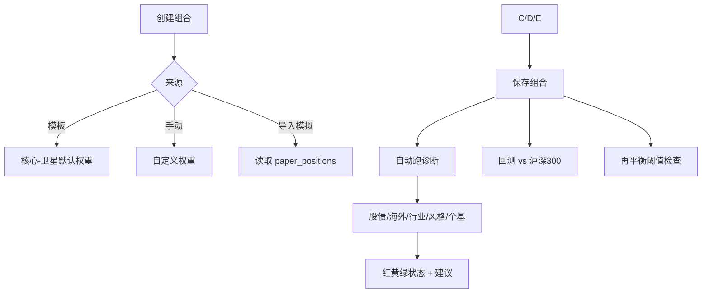

#### 3.6.3 页面设计

- 原型页 ⑥：组合构建；诊断报告（红黄绿表格）；回测曲线；再平衡提醒。

#### 3.6.4 数据库设计

- `portfolios`, `portfolio_weights`, `rebalance_rules`。

#### 3.6.5 接口设计

- `POST /api/portfolios`, `GET /api/portfolio/{id}`, `GET /api/portfolio/{id}/diagnosis`, `GET /api/portfolio/{id}/rebalance`, `GET /api/portfolio/{id}/backtest`

#### 3.6.6 安全与溯源

- 诊断规则阈值集中配置，便于投资导师审定（OQ-14）。
- 回测必须严格时间顺序，避免未来函数。

---

### 3.6.7 回测并发与缓存设计（性能优化改造）

- 组合回测 vs 沪深300 用 vectorbt 一次性向量化（§3.6.2）。
- **批量诊断**：若对多组合批量跑诊断 / 回测，按 `portfolio_id` 分片 `ProcessPoolExecutor` 并行；结果缓存 `portfolio:backtest:{id}`。
- **严格时序**：回测必须按交易日顺序重放，禁用未来函数（§3.6.6）。

---

### 3.7 宏观市场认知底盘模块

#### 3.7.1 功能说明

先定仓位再选基：核心宏观指标优先展示（其余折叠）、市场情绪、外围传导（隔夜美股/中概/A50）、高位信号四维排查、股债中枢建议（FR-38/39，DC-010）。

#### 3.7.2 流程/逻辑实现

```mermaid
flowchart LR
    A[刷新宏观] --> B[核心指标 PMI/CPI/利率/汇率]
    A --> C[市场情绪 VIX/成交/融资/北向/ETF]
    A --> D[外围隔夜数据]
    D --> E{休市?}
    E -->|是| F[标"暂无"]
    E -->|否| G[生成次日开盘研判]
    A --> H[高位四维排查]
    H --> I[阶段+操作暗示]
    I --> J[股债中枢建议]
    J --> K[跳转组合]
```

#### 3.7.3 页面设计

- 原型页 ⑦：宏观卡（核心+折叠）；情绪仪；外围传导卡；高位排查表；股债中枢建议卡。

#### 3.7.4 数据库设计

- `macro_indicators`, `market_sentiment`, `external_signal`。

#### 3.7.5 接口设计

- `GET /api/macro/dashboard`, `GET /api/macro/high-signal`, `GET /api/macro/position`

#### 3.7.6 安全与溯源

- 宏观数据强制标注"截至日期"；月度指标延迟 T+15 正常，不参与实时决策。
- 高位排查与风险模块共享同一引擎（OQ-23）。

---

### 3.8 单基深度实验室模块

#### 3.8.1 功能说明

把评估变推演：回本测算、三情景推演、五策略对照，并可存笔记/联动模拟持仓（FR-40~42，DC-011）。

#### 3.8.2 流程/逻辑实现

```mermaid
flowchart LR
    A[输入当前收益率] --> B{>=0?}
    B -->|是| C[提示已盈利]
    B -->|否| D[回本需涨=abs(r)/(1+r)]
    D --> E[保守/基准/乐观三情景回本时间]
    E --> F[策略对照: 持有/定投/波段/调仓/止损]
    F --> G[存笔记 / 联动模拟持仓]
```

#### 3.8.3 页面设计

- 原型页 ⑧：回本测算器；情景推演表；策略对照表。

#### 3.8.4 数据库设计

- 复用 `notes` 存储测算结果；`case_scenarios` 用于案例回放。

#### 3.8.5 接口设计

- `GET /api/fund/{code}/breakeven`, `/api/fund/{code}/scenarios`, `/api/fund/{code}/strategies`

#### 3.8.6 安全与溯源

- 输入收益率来自数据中心真实净值，禁止编造（OQ-25）。

---

### 3.9 持仓穿透与舆情模块

#### 3.9.1 功能说明

从基金穿透到重仓股：前十大按占净值比排序、逐股舆情标签+来源+时间、四维度财务透视、AI 周评统一出口（FR-43/44，DC-012）。

#### 3.9.2 流程/逻辑实现

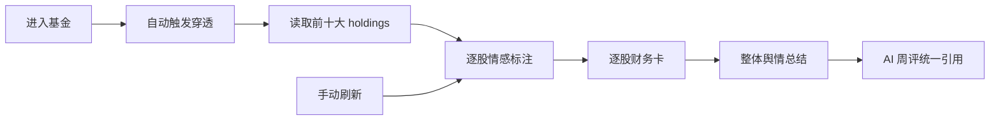

#### 3.9.3 页面设计

- 原型页 ⑨：前十大表（来源+时间）；四维度财务卡；舆情周评。

#### 3.9.4 数据库设计

- `holdings`, `sentiment_news`, `stock_financials`。

#### 3.9.5 接口设计

- `GET /api/fund/{code}/sentiment`, `GET /api/fund/{code}/financials`

#### 3.9.6 安全与溯源

- 舆情必须带 `source` 与 `published_at`；数据不足标"暂不确认"。
- 财务卡标注"截至报告期 + 数据来源"。

---

### 3.9.7 并发抓取与 LLM 限流（性能优化改造）

- **新闻并发抓取**：进入基金后，前十大个股新闻用 `ThreadPoolExecutor` 并发拉取（每源设超时），缩短穿透响应（§3.9.2）。
- **情感标注限流**：逐股情感走 LLM，复用 §3.4.8 的 `LLM_SEMAPHORE`，避免集中冲击触发降级。
- **逐股并发**：个股财务卡（§3.9.4）并行读取，结果均带 `source` / `published_at`（§3.9.6）。

```python
from concurrent.futures import ThreadPoolExecutor, as_completed

def penetrate(code: str):
    top10 = load_holdings(code)[:10]
    with ThreadPoolExecutor(max_workers=10) as ex:     # I/O 密集，线程池
        news = [ex.submit(fetch_news, h["stock_code"]) for h in top10]
        fins = [ex.submit(load_financials, h["stock_code"]) for h in top10]
    # 聚合 + 逐股情感（情感走 LLM 信号量，见 §3.4.8）
```

---

### 3.10 学习投教模块

#### 3.10.1 功能说明

指标词典（全站 tooltip 可引用）、学习路径（角色三阶段+跳转）、案例回放沙盒、行为金融自评（FR-25~28/47/48，DC-007）。

#### 3.10.2 流程/逻辑实现

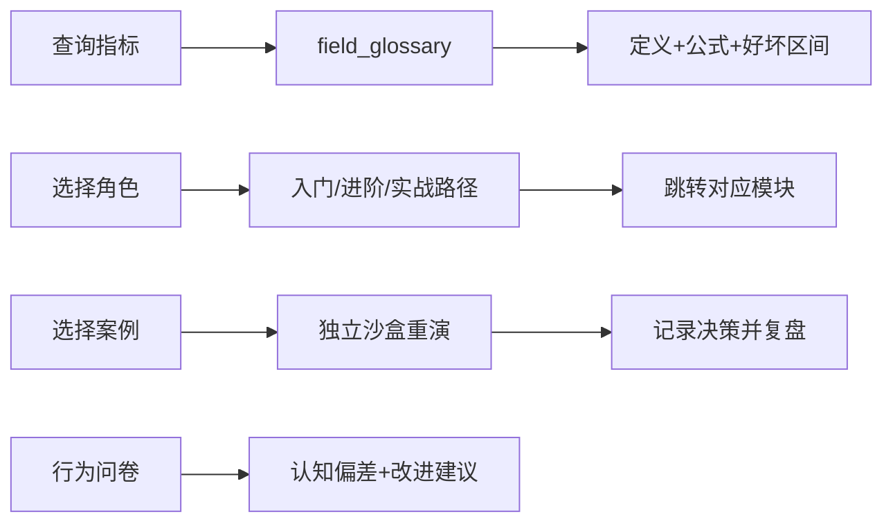

#### 3.10.3 页面设计

- 原型页 ⑩：指标词典；学习路径树；案例回放入口；行为问卷。

#### 3.10.4 数据库设计

- `field_glossary`, `learning_paths`, `case_scenarios`, `case_replay_logs`, `behavior_assessments`, `notes`。

#### 3.10.5 接口设计

- `GET /api/learning/dictionary`, `/api/learning/path`, `POST /api/learning/case-replay/{scenario_id}`, `POST /api/learning/behavior`

#### 3.10.6 安全与溯源

- 案例回放使用独立 account_id 沙盒，不影响主账户资产（OQ-17）。

---

### 3.11 AI 智能助手模块

#### 3.11.1 功能说明

LLM+RAG：研报解读、经理画像、持仓变化、自动周报、问答；RAG 仅检索内容、无依据拒答、持仓舆情周评统一出口、失败降级（FR-29~32，DC-008）。

#### 3.11.2 流程/逻辑实现

```mermaid
flowchart TD
    A[用户提问] --> B[RAG 检索]
    B --> C{检索到相关文档?}
    C -->|否| D[返回"无依据"拒答]
    C -->|是| E[LLM 基于检索内容生成答案]
    E --> F[拼接 source + as_of + 仅供参考]
    G[周报任务] --> H[读取持仓舆情/组合诊断/宏观]
    H --> I[LLM 聚合生成周评]
    J[LLM 超时/限频] --> K[降级规则摘要]
```

#### 3.11.3 页面设计

- 原型页 ⑪：快捷指令；对话窗（含拒答样例）；持仓舆情周评卡；失败降级说明。

#### 3.11.4 数据库设计

- `rag_documents`, `ai_weekly_reports`。

#### 3.11.5 接口设计

- `POST /api/ai/weekly`, 问答接口（可复用 `/api/ai/chat`）

#### 3.11.6 安全与溯源

- 所有 AI 输出强制三要素：`source`, `as_of`, "仅供参考，不构成投资建议"。
- 绝不输出具体买卖建议。

---

### 3.11.7 异步与独立周报 worker（性能优化改造）

- **问答**：`async def chat(req)` —— RAG 检索（Chroma，快）+ LLM 生成（async + 信号量，复用 §3.4.8）；无依据按 §3.11.2 拒答。
- **周报抽独立 worker**：§3.14.2 周一 9:00 由调度触发 `worker-report` 进程（独立部署单元，复用 `domain/`），聚合持仓舆情 / 组合诊断 / 宏观 → LLM 生成 → 落 `ai_weekly_reports`；失败降级规则摘要（§2.15）。

```python
sem = asyncio.Semaphore(LLM_SEMAPHORE)

async def chat(req):
    docs = chroma_similarity(req.query, k=5)          # 快
    if not docs:
        return reject("无依据")
    async with sem:                                    # LLM 限流
        return await llm_complete(build_rag_prompt(docs, req.query))
```

---

### 3.12 风险与监控模块

#### 3.12.1 功能说明

风险测评联动默认配置/模拟起点仓位、预警中心聚合、估值定投信号（PE 分位→倍数）、数据质量监控（FR-33~36/38，DC-009）。

#### 3.12.2 流程/逻辑实现

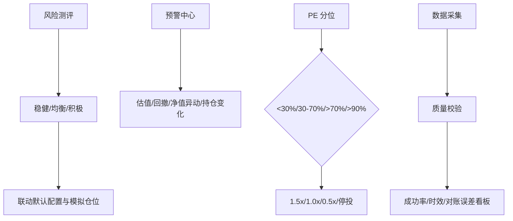

#### 3.12.3 页面设计

- 原型页 ⑫：风险测评卡；预警中心列表；估值定投信号表；数据质量监控卡；高位排查共享结果。

#### 3.12.4 数据库设计

- `risk_assessments`, `alerts`, `valuation_signals`, `data_quality_log`。

#### 3.12.5 接口设计

- `POST /api/risk/assess`, `GET /api/alerts`, `GET /api/valuation-signals`, `GET /api/quality/dashboard`

#### 3.12.6 安全与溯源

- 预警仅提示风险，不输出确定性建议。
- 数据质量监控为 Must，从 M1 起埋点。

---

### 3.13 仪表盘首页模块

#### 3.13.1 功能说明

全站统一入口：状态聚合、类型 Tab Top10 综合评分、近期动态（新发/异动/分红/信号）、学一基卡、折叠次要（FR-D1~D6，DC-001）。

#### 3.13.2 流程/逻辑实现

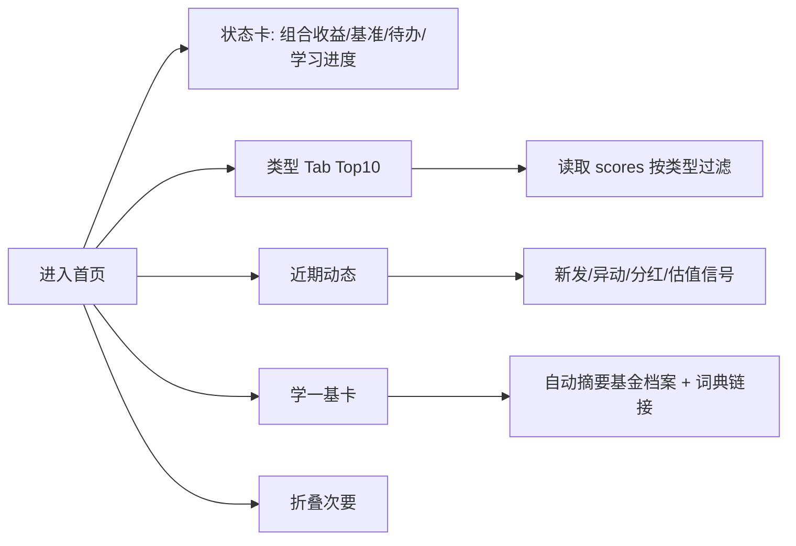

#### 3.13.3 页面设计

- 原型页 ①：状态区 → 榜单区 → 学习区三段式。

#### 3.13.4 数据库设计

- 复用 `paper_accounts`, `scores`, `fund_dividends`, `alerts`, `valuation_signals`, `funds`, `field_glossary`。

#### 3.13.5 Redis 设计

- `fund:dashboard:{account_id}`：聚合视图缓存，TTL 5 min。
- `fund:top10:{type}`：榜单缓存，TTL 15 min。

#### 3.13.6 接口设计

- `GET /api/dashboard`

#### 3.13.7 安全与溯源

- Top10 评分必须来自评估引擎唯一权威源（DC-003）。
- 动态卡估值信号与风险模块共用同一引擎（OQ-3）。

---

### 3.14 任务调度与监控模块

#### 3.14.1 功能说明

统一编排定时任务：数据采集、指标重算、周报生成、舆情更新、估值信号刷新、备份。

#### 3.14.2 流程/逻辑实现

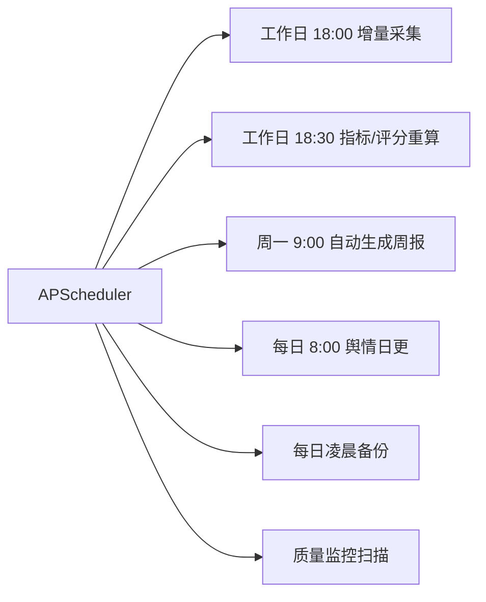

#### 3.14.3 数据库设计

- 可选 `scheduler_jobs` 表记录任务执行历史与状态。

#### 3.14.4 接口设计

- `POST /api/admin/trigger-job`（手动触发，可选，**须管理员登录，见 §2.19.6**）。

#### 3.14.5 安全与溯源

- 所有定时任务写入日志，失败告警。
- 任务幂等设计，避免重复采集。
- `POST /api/admin/trigger-job` 须管理员鉴权（§2.19.6），未登录返回 `40101`，非管理员返回 `40103`。

---

### 3.14.6 分布式锁与调度防重（性能优化改造）

- **多副本调度防重**：scheduler 多副本时，任务触发前获取 Redis `SET NX` 锁；获锁才执行，执行完删锁；未获锁跳过，避免重复采集 / 重算。
- **单 leader 备选**：仅一个副本设 `SCHEDULER_LEADER=true` 执行全部定时任务，其余副本不触发。
- **采集分片互斥**：collector 已按 code hash 分片（§3.1.8），天然不重叠；锁为兜底防脑裂。

```python
import redis, uuid
r = redis.Redis(...)

def with_lock(job: str, fn):
    token = uuid.uuid4().hex
    if not r.set(f"fund:scheduler:lock:{job}", token, nx=True, ex=3600):
        return False                                  # 未获锁，跳过
    try:
        fn()
    finally:
        if r.get(f"fund:scheduler:lock:{job}") == token:
            r.delete(f"fund:scheduler:lock:{job}")
    return True
```

---

## 4. 测试策略、错误码与质量保障

> 本节闭环评审严重级 S1（测试覆盖重点）、S2（错误码规范）与 13.2（性能目标）。

### 4.1 测试分层与覆盖重点

| 层级   | 覆盖重点                                                                                                                                                                                                                                                        | 说明                                 |
| ---- | ----------------------------------------------------------------------------------------------------------------------------------------------------------------------------------------------------------------------------------------------------------- | ---------------------------------- |
| 单元测试 | `scoring.py` 五因子权重 / 归一化 / 因子分解；`stylebox.py` 持仓法 + 收益回归交叉验证；`attribution.py` Brinson 仅 `mixed`/`stock`；`research.py` PEG/ERP 代理 + `RESEARCH_PROXY_GUARD` 守卫 + `available=False` 路径；`screen.py` 表单过滤 + NL 映射 + 相似去重阈值；`paper.py` 买/卖/重置原子性 + T 日净值成交 + 分红复权 | 纯函数、无外部依赖、可 CI 高频跑                 |
| 集成测试 | 采集→清洗→写入→质量校验链路；评估→筛选→仪表盘评分一致（唯一权威源 ADR-002）；模拟交易→组合导入→诊断                                                                                                                                                                                                   | 用 AkShare/Tushare 抽样 + 固定 fixtures |
| 回归测试 | 评分 / 代理口径变更后跑全量 **160 条 NL 评测语料（100 结构化 + 60 对抗）**，`NL_ACCURACY_TARGET=0.85` 严格 / 宽松双口径不回退                                                                                                                                                                  | 见 §3.4.7、§6_NL选基评测                 |

### 4.2 错误码规范

统一错误响应体：`{"code":<错误码>,"message":"<可读信息>","source":null,"as_of":null,"trace_id":"<链路ID>"}`。错误码枚举：

| 错误码   | 含义       | 触发场景                         |
| ----- | -------- | ---------------------------- |
| 0     | 成功       | —                            |
| 40001 | 参数校验失败   | 缺字段 / 类型错 / 越界               |
| 40002 | 资源不存在    | 基金代码 / 组合不存在                 |
| 40003 | 业务规则冲突   | 重置未二次确认 / 非交易时段顺延提示          |
| 40101 | 未认证      | admin 端点未登录                  |
| 40103 | 无权限      | 非管理员访问 admin                 |
| 40301 | 操作被守卫拦截  | `RESEARCH_PROXY_GUARD` 口径未定义 |
| 42901 | 外部限频     | Tushare / LLM 返回 429         |
| 50001 | 内部计算异常   | 已降级，返回标红 / 暂无                |
| 50301 | 数据源不可用   | AkShare + Tushare 皆失         |
| 50302 | 数据库不可用   | 连接失败                         |
| 50303 | LLM 超时降级 | 超时 / 限频，回退规则摘要               |

### 4.3 性能目标（SLA，设计值）

| 指标           | 目标                        | 说明                           |
| ------------ | ------------------------- | ---------------------------- |
| API P95 响应时间 | 普通查询 ≤ 800ms；评估 / 筛选 ≤ 2s | 监控阈值见 §2.16（P95>2s 告警）       |
| API 错误率      | < 1%                      | 监控阈值见 §2.16                  |
| 单实例 QPS      | ≥ 20                      | 单用户 MVP，预留余量                 |
| 采集任务         | 单源耗时 < 30min，成功率 ≥ 95%    | 监控阈值见 §2.16                  |
| 缓存命中率        | ≥ 80%                     | dashboard / top10 / score 热键 |

### 4.4 异常流测试方法

- **断网**：采集失败 → Tushare fallback → 皆失返回 `50301` 并告警；DB 失败 → `50302`，前端降级静态说明。
- **超时**：LLM 超时 → 降级规则摘要（`50303`）。
- **脏数据**：NAV 缺失 / 异常 → 字段置空标"暂无"；交叉验证误差 > 0.5% → `cv_flag=true` 标红。
- **边界**：NAV=0 / 负久期 / 极值输入 → 不崩溃，返回 `40001` 或 `50001`（已降级）。
- **权限**：未登录访问 `/api/admin/*` → `40101`；非管理员 → `40103`。

---

## 5. 附录

### 5.1 架构决策记录

#### ADR-001：模块化单体（Modular Monolith）

- **背景**：单人/小团队、低成本、快速交付。
- **决策**：采用模块化单体，按 `domain/` 分包；FastAPI + Streamlit 同机部署。
- **后果**：部署简单、延迟低；未来若团队扩大，可沿模块边界拆分为服务。

#### ADR-002：评估引擎为唯一评分权威源

- **背景**：避免仪表盘/筛选器/组合出现评分不一致（DC-003）。
- **决策**：`scoring.py` 为唯一评分入口；其他模块通过函数/API 只读引用；权重调节仅在评估详情页。
- **后果**：全站一致，但评估引擎成为关键依赖，需保证高可用与缓存。

#### ADR-003：三层存储（PostgreSQL + Parquet + Chroma）

- **背景**：关系数据、大规模时间序列、向量检索需求并存。
- **决策**：PostgreSQL 存关系/配置/元数据；Parquet 存净值/宏观日频；Chroma 存季报向量。
- **后果**：兼顾事务一致性、分析性能、RAG 检索，但增加运维复杂度。

#### ADR-004：Redis 缓存层（升级：多副本下为必需）

- **背景**：首页/榜单/字段解释等热数据可加速；且多副本（§2.22.3）需共享缓存、admin 会话（§2.19.6）、调度锁（§3.14.6）。
- **决策**：MVP 单机可用 PostgreSQL + 进程内内存缓存替代；**生产 / 多副本下 Redis 为必需**，承载共享评分缓存、会话与锁。
- **后果**：降低 MVP 成本，保留扩展性；引入 Redis 运维依赖，但换取水平扩展与数据一致性。

### 5.2 接口响应通用契约

```json
{
  "code": 0,
  "data": {},
  "source": "AkShare/Tushare",
  "as_of": "2025-07-20",
  "disclaimer": "仅供参考，不构成投资建议",
  "message": ""
}
```

### 5.3 缩略语

| 缩写      | 含义                    |
| ------- | --------------------- |
| NAV     | 基金净值                  |
| ETF/LOF | 交易型开放式指数基金 / 上市型开放式基金 |
| PE      | 市盈率                   |
| ERP     | 股权风险溢价                |
| PEG     | 市盈增长比率                |
| RAG     | 检索增强生成                |
| DCA     | 定投（美元/人民币成本平均法）       |
| SLA     | 服务级别协议                |

---

*本文档由软件架构师基于 BRD v1.2、需求确认记录 DC-001~012、技术可行性评估 v1.2、技术规格说明书 v1.3 及原型 v1.2 产出，作为系统实现期的施工依据。*
